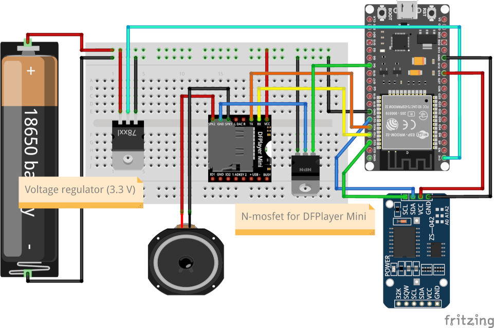

# ClockSilencer
ClockSilencer is a simple ESP32 device. It plays recorded chime on certain hours.
## Why do I need that?
The problem is, I've got an antique pendulum clock from 1930s. When it chimes, it chimes all day long, day and night. I just wanted to silence it at night.
My first idea was to build a blocking mechanism inside the clock box, but it turns out to be very difficult and I had some doubts about the clock mechanism.
Much more elegant solution is having another electronic clock, that plays recorded chime on certain hours.

## Hardware:
- ESP32 WROOM
- DFPlayer mini
- micro SD card (a small one will be enough - 8gb or even less)
- MOSFET transistor (it turns out that DFPlayer is power-hungry even if it sleeps, so it's better to cut its power)
- DS3231 RTC 
### Why not use ESP32's internal RTC?
Because it turns out, when in deepsleep, internal RTC becomes inacurrate (like 5 minutes in 12 hours)

## Libraries:
- RTClib - runs DS3231 clock
- HardwareSerial - as DFPlayer is driven by Serial port, second serial must be set.
- DFPlayerMini_Fast - driver for DFPlayer Mini, but not from DFRobot :)
- FireTimer (dependency of DFPlayer library)

## Wiring:

